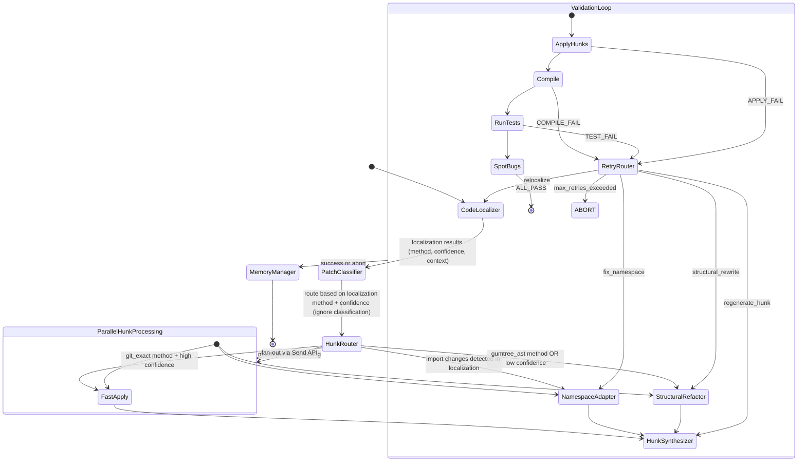

# OmniPort: Production-Grade LLM-Agnostic Patch Backporting System
**Comprehensive Architecture & Phase-Level Implementation Plan**

## 1. Executive Summary
**OmniPort** is a 9-agent LangGraph state machine designed to route patches through complexity-tiered pipelines, achieving high backport success across TYPE I–V patches. It combines advanced memory patterns with a 5-stage hybrid code localization pipeline (git pickaxe + GumTree AST diff + JavaParser symbol resolution + embedding search). 

This system replaces the legacy monolithic 5-phase pipeline (e.g., `context_analyzer_node`, `structural_locator_node`) with per-hunk type routing, structured retry contexts (`PatchRetryContext`), and a persistent lessons-learned memory layer. Crucially, the architecture is designed to be **LLM-agnostic**, using OpenAI-compatible API endpoints to seamlessly support any provider (e.g., OpenAI, vLLM, Ollama, Anthropic via proxy).

---

## 2. LLM-Agnostic Architecture & Memory Design

Instead of relying solely on specific proprietary models, OmniPort utilizes an OpenAI-compatible routing layer (e.g., via `litellm` or standard `base_url` overrides) mapped to three functional tiers. 

| Role | Target Profile | Input/Output Token Budget | Example Compatible Models |
|------|----------------|---------------------------|---------------------------|
| **Fast/Cheap** | High-speed routing, classification, memory | 4K / 500 | GPT-4o-mini, Llama-3-8B, Claude 3.5 Haiku, DeepSeek-V3 |
| **Balanced** | Context-heavy synthesis, namespace adaptation | 5-8K / 1-2K | GPT-4o, Llama-3-70B, Claude 3.5 Sonnet |
| **Reasoning** | Deep structural refactoring, extended thinking | 15K / 5K | o1-preview, o3-mini, DeepSeek R1, GPT-4o |

**Configuration:** Read from `.env` using `OPENAI_BASE_URL` and `OPENAI_API_KEY`, allowing seamless redirection to local inference or enterprise gateways.

### 2.1 Three-Tier Memory Architecture
Inspired by production TAOR loops, memory is structured for minimal context pollution:
1. **PatchKnowledgeIndex:** Always in the system prompt. Lists known API renames, version-specific gotchas, and common failure patterns per target repo.
2. **TopicFiles:** Loaded on-demand per repository (e.g., `elasticsearch_api_changes.md`).
3. **SessionTranscripts:** JSONL transcripts of past backport attempts, searched only via grep (never bulk-loaded).

### 2.2 AutoDream Background Consolidation
A **ConsolidationAgent** (Memory Manager) runs after every batch of 50 patches. It scans validation results to extract durable lessons (e.g., "In Elasticsearch 7.x→6.x, `ActionListener.wrap()` was renamed to `ActionListener.toBiConsumer()`"). These feed the PatchKnowledgeIndex to prevent repeated failures.

### 2.3 Cache-Aware Prompt Assembly
System prompts are split into a static/dynamic boundary to maximize KV cache reuse (~76% cost reduction). Patch-type routing rules, CLAW application instructions, and build conventions stay in the static section. Repo-specific context, patch diffs, and retry history go in the dynamic section.

---

## 3. The 5-Stage Hybrid Code Localization Pipeline

The system subsumes the legacy `context_analyzer_node` and `structural_locator_node` into a cascading pipeline ordered by computational cost:

1. **Git-native localization (Free, <100ms):** 
   - Uses `git diff --find-renames=30`, `git log -S "symbol"`, `git log --follow`, and `git ls-tree` blob SHA comparison. Resolves **100% of TYPE I** patches.
2. **Fuzzy text matching (<1s per file):** 
   - Uses RapidFuzz `token_sort_ratio` (0.75 threshold) and line-level LCS (mpatch algorithm) for whitespace/reformatting drift. Resolves **TYPE II** patches.
3. **AST structural matching via GumTree (~2-5s per file):** 
   - Uses `gumtree-spoon-ast-diff` (`bu_minsim=0.2`, `bu_minsize=600`) to compute Insert, Delete, Update, and **Move** operations. Detects renamed identifiers/moved methods for **TYPE III** patches.
4. **Symbol resolution via JavaParser (<500ms per query):** 
   - Resolves fully qualified names using `CombinedTypeSolver` (Source + JarTypeSolver + ReflectionTypeSolver). Uses `japicmp` on compiled JARs for authoritative API change detection. Resolves **TYPE III/IV** patches.
5. **Embedding-based semantic search (LLM Fallback):** 
   - For **TYPE V** patches. Uses UniXcoder (stored in FAISS index) to embed code chunks. Queries original patch context to find functionally equivalent target code.

---

## 4. The 9-Agent LangGraph Architecture

The system uses a LangGraph `StateGraph` with conditional routing, parallel fan-out (`Send` API), and structured retry loops.



### Agent Specifications & Token Budgets

1. **Agent 0 — Git Orchestrator (No LLM):** Manages branch checkouts, `git worktree` isolation, patch extraction. Maintains clean/dirty state. Fails closed on bash operations.
2. **Agent 1 — Code Localizer (Fast LLM + Tools):** Executes the 5-stage hybrid localization per-hunk, per-file. Outputs `LocalizationResult` (confidence, method used, context snapshot, symbol mappings).
3. **Agent 2 — Patch Classifier (Fast LLM):** Classifies patch/hunks (TYPE I-V) using localization evidence from Code Localizer for observability and metrics only. Does NOT drive routing decisions. Outputs `PatchClassification` with confidence and token budget estimates. Uses unified diff, localization method evidence, and PatchKnowledgeIndex. Preprocessing logic (auto-generated detection) is handled before LLM invocation.
4. **Agent 3 — Fast-Apply Agent (No LLM):** Routed when localization method is `git_exact` and confidence is high (>0.85). Uses deterministic `git apply` or CLAW exact-string replacement. Performs no LLM-based reasoning. If CLAW pre-validation fails, route to code relocalizer instead of using LLM.
5. **Agent 4 — Namespace Adapter (Balanced LLM):** For TYPE III. Uses JavaParser `ImportDeclaration` manipulation and symbol mapping to rewrite imports/method references.
6. **Agent 5 — Structural Refactor (Reasoning LLM):** For TYPE IV/V. Inputs GumTree edit scripts, japicmp reports, call graphs. Achieves semantic equivalence in structurally different codebases.
7. **Agent 6 — Hunk Synthesizer (Balanced LLM):** Produces CLAW-compatible exact-string `old_string`/`new_string` pairs. Asserts `old_string` exists verbatim in target. If failed, expands context ±5 lines.
8. **Agent 7 — Validation Loop (Balanced LLM):** Enhances the legacy `validation_agent.py` "Prove Red, Make Green" loop. Emits `PatchRetryContext` instead of plain strings. Deterministic routing:
   - `apply_failure_context_mismatch` → Relocalize
   - `compile_error_missing_import` → Namespace Adapter
   - `compile_error_missing_symbol` → Structural Refactor
   - `test_failure_assertion` → Regenerate hunk
9. **Agent 8 — Memory Manager (Fast LLM):** Runs AutoDream background consolidation after every 50 patches. Updates SQLite `PatchLesson` schema.

### Shared State & Parallelization Strategy
Uses a `BackportState` TypedDict. For multi-file patches, the Code Localizer analyzes import graphs (via JavaParser).
- **Independent files:** Dispatched in parallel (`max_concurrency=5`) via LangGraph `Send` API.
- **Dependent groups:** Processed sequentially in topological order.
- Mixed-complexity patches (e.g., some hunks via git_exact, others via gumtree_ast in same commit) are fanned out per-hunk via **HunkRouter** based on localization method + confidence, avoiding expensive LLM calls for chunks we found exactly.

---

## 5. Project Directory Structure

The system is divided into a Python LangGraph orchestrator and a Java-based microservice for high-performance AST/symbol operations.

```text
omniport/
├── README.md
├── requirements.txt
├── .env.example                # Must include OPENAI_API_KEY, OPENAI_BASE_URL
├── docker-compose.yml          # For spinning up FAISS, DB, and Java Microservice
│
├── java-microservice/          # Standalone JVM process (JSON over stdin/stdout or local HTTP)
│   ├── pom.xml                 # Dependencies: JavaParser 3.28.x, gumtree-spoon-ast-diff 1.9, japicmp 0.25.4
│   └── src/main/java/com/omniport/
│       ├── OmniPortServer.java # Main entry point
│       ├── ast/                # JavaParser CombinedTypeSolver & structural diffing
│       ├── diff/               # GumTree integration (bu_minsim=0.2, bu_minsize=600)
│       └── api/                # japicmp integration for JAR diffing
│
├── src/
│   ├── main.py                 # CLI entry point for processing patches
│   ├── core/
│   │   ├── graph.py            # LangGraph StateGraph definition & multi-file parallel routing
│   │   ├── state.py            # TypedDict BackportState, PatchRetryContext, LocalizationResult
│   │   └── llm_router.py       # LLM-agnostic provider setup (Maps tiers to OpenAI SDK)
│   │
│   ├── agents/                 # The 9 LangGraph Agents
│   │   ├── agent0_git.py       # Git Orchestrator
│   │   ├── agent1_localizer.py # Code Localizer
│   │   ├── agent2_classifier.py# Patch Classifier
│   │   ├── agent3_fastapply.py # Fast-Apply Agent
│   │   ├── agent4_namespace.py # Namespace Adapter
│   │   ├── agent5_structural.py# Structural Refactor
│   │   ├── agent6_synthesizer.py # Hunk Synthesizer
│   │   ├── agent7_validator.py # Validation Loop
│   │   └── agent8_memory.py    # Memory Manager
│   │
│   ├── localization/           # The 5-Stage Hybrid Pipeline (Called by Agent 2)
│   │   ├── stage1_git.py       # pickaxe, --find-renames=30, ls-tree
│   │   ├── stage2_fuzzy.py     # RapidFuzz token_sort_ratio (0.75), line-level LCS
│   │   ├── stage3_gumtree.py   # Client to java-microservice for structural diff
│   │   ├── stage4_javaparser.py# Client to java-microservice for symbol resolution
│   │   └── stage5_embedding.py # UniXcoder + FAISS semantic search
│   │
│   ├── tools/
│   │   ├── build_systems.py    # Maven/Gradle integration (from legacy validation_tools.py)
│   │   ├── java_client.py      # Python client for communicating with java-microservice
│   │   └── patch_parser.py     # Unified diff parsing
│   │
│   └── memory/
│       ├── db.py               # SQLite schema for PatchLesson
│       ├── index_manager.py    # Manages PatchKnowledgeIndex
│       └── transcripts/        # JSONL SessionTranscripts
│
├── tests/
│   ├── evaluation_harness/     # Scripts for the 491-example dataset
│   │   ├── run_eval.py         # Measures apply rate, compile rate, pass rate, tokens, latency
│   │   └── run_ablations.py    # Runs 5 specific ablation conditions
│   └── golden_set/             # 50 patches (10 per TYPE I-V) for CI regression testing
│
└── legacy/                     # Retained for reference and porting existing tools
    ├── evaluate_full_workflow.py
    ├── validation_agent.py
    └── validation_tools.py
```

---

## 6. Phase-Level Implementation Plan

The implementation strictly follows a 3-release migration strategy outlined in the research report, preceded by a foundational setup phase.

### Phase 0: Foundation & Infrastructure (Weeks 1-2)
**Goal:** Set up the shared state, agnostic LLM routing, and Java microservice bridge.
1. **Core State Definition:** Implement `src/core/state.py` containing `BackportState` TypedDict, `PatchClassification`, `LocalizationResult`, and `PatchRetryContext`.
2. **LLM Router:** Implement `llm_router.py` with the FAST, BALANCED, and REASONING tiers using OpenAI-compatible SDKs.
3. **Java Microservice:** Scaffold the Maven project (`java-microservice`).
   *   Integrate JavaParser 3.28.x (`CombinedTypeSolver`).
   *   Integrate `gumtree-spoon-ast-diff 1.9` (`bu_minsim=0.2`, `bu_minsize=600`, 30s timeout).
   *   Integrate `japicmp 0.25.4` (Class/API diffing).
   *   Establish JSON-over-stdin/stdout communication with `src/tools/java_client.py`. (Why a microservice? Python cannot natively execute Java libraries quickly. Starting a JVM process via `subprocess.run` takes 0.5-2 seconds per query. A long-lived JVM microservice drops latency to `<100ms` per query, which is strictly required to hit the `<30s` latency target for TYPE I patches).
4. **Git Orchestrator (Agent 0):** Implement basic checkouts, `git worktree` isolation, and the fail-closed bash allowlist.
5. **Memory DB:** Initialize SQLite schema for `PatchLesson`.

### Phase 1: Shadow Mode & Localization (Release 1)
**Goal:** Deploy new classification and localization in "shadow mode" without disrupting the legacy pipeline. Compare accuracy.
1. **Agent 1 (Code Localizer):** Implement Stages 1 through 5 (Git, Fuzzy, GumTree, JavaParser, Embedding).
2. **Agent 2 (Patch Classifier):** Implement structured output parsing. Detect TYPE I-V using evidence from Agent 1 (e.g. `method_used`). Implement `src/tools/preprocessor.py` for auto-generated file detection (Lombok `@Generated`, MapStruct, JOOQ, Thrift, OpenAPI).
3. **Shadow Integration:** Modify `legacy/evaluate_full_workflow.py` to run Agent 1 and Agent 2, log their localization accuracy against existing Phase 1/2, but proceed with legacy execution.

### Phase 2: Core Replacement & Validation (Release 2)
**Goal:** Completely remove legacy Phase 1 & 2. Introduce exact-string constraints and the new validation routing.
1. **Agent 3 (Fast-Apply):** Implement deterministic line-offset adjustment for TYPE I/II patches.
2. **Agent 6 (Hunk Synthesizer):** Generate exact `old_string`/`new_string` pairs. *Critical validation:* Assert `old_string in target_file_content`. Fallback to ±5 line expansion on failure.
3. **Agent 7 (Validation Loop):** Port `validation_agent.py`. 
   *   Replace `regeneration_hint` with `PatchRetryContext`.
   *   Port `ValidationToolkit` from `validation_tools.py` (retain Maven/Gradle subprocess patterns, regex error parsing, `ELASTICSEARCH_HARNESS_EXCLUDED_TEST_MODULES`).
   *   Add SpotBugs enhancements (`onlyAnalyze`, custom detectors for null-safety/resource leaks).
4. **LangGraph Wire-up:** Connect Graph to route failures deterministically based on `PatchRetryContext` (e.g., `compile_error_missing_import` routes back to Namespace Adapter, not the beginning).

### Phase 3: Full Routing & Multi-Agent Intelligence (Release 3)
**Goal:** Activate TYPE III-V handling, parallel processing, and persistent memory.
1. **Agent 4 (Namespace Adapter):** Implement JavaParser `ImportDeclaration` manipulation.
2. **Agent 5 (Structural Refactor):** Implement complex fallback using REASONING_MODEL for TYPE IV/V. Include GumTree edit scripts and japicmp call graphs in prompt.
3. **HunkRouter & Parallel Fan-out:** Implement LangGraph `Send` API that routes each hunk based on localization method + confidence (ignore classifier output). Routing rules: `git_exact` + confidence >0.85 → Fast-Apply; `gumtree_ast` OR confidence <0.6 → Structural Refactor; import changes detected → Namespace Adapter. Analyze import graphs via JavaParser to process independent files in parallel (max_concurrency=5) and dependent groups sequentially. Apply 15-file hard limit (80K token cap).
4. **Agent 8 (Memory Manager):** Implement the AutoDream consolidation daemon (runs every 50 patches). Maintain the 3-tier memory (PatchKnowledgeIndex, TopicFiles, Transcripts).
5. **Token Circuit Breaker:** Monitor `Tokens_used` in state. 70% -> Downgrade Agent 5. 85% -> Downgrade all to FAST_MODEL. 95% -> Abort and checkpoint LangGraph state.

### Phase 4: Evaluation & Hardening
**Goal:** Prove the system against the metrics defined in the research report.
1. **491-Example Dataset Run:** Measure against targets:
   *   TYPE I Apply Rate: >95% (<10K tokens, <30s)
   *   TYPE III Apply Rate: >70% (<30K tokens, <120s)
   *   Overall Compile Rate: >98%
   *   TYPE V Token Cap: <100K tokens, <300s
2. **Ablation Studies:** Run the 5 scenarios (No Classifier, No GumTree, No japicmp, No Memory, No Per-hunk Routing) and record McNemar's test significance.
3. **Regression CI:** Establish the 50-patch Golden Set. Integrate `pipeline_summary` JSON generation logging `tokens_by_agent`, `latency_by_phase`, and `new_lessons`.

---

## 7. Tool Integration & Legacy System Porting

### Java Tools as Microservices (Performance Mandate)
As stated in Phase 0, JavaParser, GumTree, and japicmp run as a small Java microservice. The research report mandates this to eliminate the per-invocation JVM startup costs associated with running these tools as subprocess CLI calls from Python, which would destroy latency targets on multi-file patches.

### Legacy Validation Integration
Retain and augment `evaluate_full_workflow.py` and `validation_tools.py` (`ValidationToolkit`):
- **Build System Subprocesses:** Continue using `subprocess.run()` (`timeout=600` for compilation, `300` for tests).
- **Maven/Gradle Parsing:** Preserve the `_classify_build_failure()` regex patterns for `[ERROR]` and `> Task :module:compileJava FAILED`.
- **Test Exclusions:** Maintain handling for structures like `ELASTICSEARCH_HARNESS_EXCLUDED_TEST_MODULES` during targeted test runs.
- **SpotBugs Improvements:** Scope via `onlyAnalyze` to modified packages. Add custom detectors for null-safety and resource leaks. Parse XML outputs.
- **Auto-generated Files:** Augment legacy ANTLR/Protobuf detection with Lombok (`@Generated`), MapStruct, JOOQ, Thrift, and OpenAPI regex scanning in the first 30 lines.

---

## 8. Evaluation Harness & Metrics

### Primary Metrics (491-Example Dataset)
Tracked at aggregate and per-TYPE levels:
1. **Patch apply rate:** >95% (TYPE I), >85% (TYPE II), >70% (TYPE III)
2. **Compile rate:** >98% overall
3. **Test pass rate (fail→pass):** Primary success metric
4. **Token cost per patch:** <10K (TYPE I), <30K (TYPE III), <100K (TYPE V)
5. **Latency (wall clock):** <30s (TYPE I), <120s (TYPE III), <300s (TYPE V)

### Ablation Study Design
1. **No Classifier:** All patches go through full pipeline (measures routing efficiency).
2. **No GumTree:** Text-only localization.
3. **No japicmp:** Measures symbol mapping contribution.
4. **No Memory Manager:** Measures knowledge persistence value.
5. **No Per-hunk Routing:** All hunks go through same pipeline.
*Use McNemar's test for statistical significance.*

---

## 9. Risks, Edge Cases & Mitigations

1. **Large Repo Localization (e.g., Elasticsearch 10M+ lines):**
   - *Mitigation:* Pre-compute FAISS indexes per branch. Only re-index changed files via `git diff`. Limit search scope to the target module and direct dependencies.
2. **Circular Renames Breaking `git --follow`:**
   - *Mitigation:* Combine with pickaxe search (`git log -S "class_name"`) and blob SHA comparison.
3. **Maven/Gradle Divergence:**
   - *Mitigation:* Git Orchestrator dynamically detects `pom.xml` vs `build.gradle` (or wrapper scripts) and uses appropriate templates, preserving legacy `validation_tools.py` robustness.
4. **Massive Patches (10+ Files):**
   - *Mitigation:* 15-file hard limit per patch. Split larger patches into dependency-grouped sub-patches processed sequentially. Total token budget cap of 80K.
5. **Token Budget Exhaustion:**
   - *Mitigation:* **Token circuit breaker**. At 70%, downgrade Structural Refactor to Balanced LLM. At 85%, downgrade all to Fast LLM. At 95%, abort and save state via LangGraph checkpointing for manual resumption.
6. **File Creation/Deletion:**
   - *Mitigation:* Git Orchestrator identifies correct directories, registers files with Maven/Gradle source sets, and ensures no dangling references using JavaParser before deletion.
7. **Test Infrastructure Failures:**
   - *Mitigation:* Enhance legacy `classify_test_failure_signal()` with timeout detection, OOM detection (exit 137), and flaky test detection (re-run 3 times). Respect ES `ESTestCase` assertions vs. infrastructure asserts.

