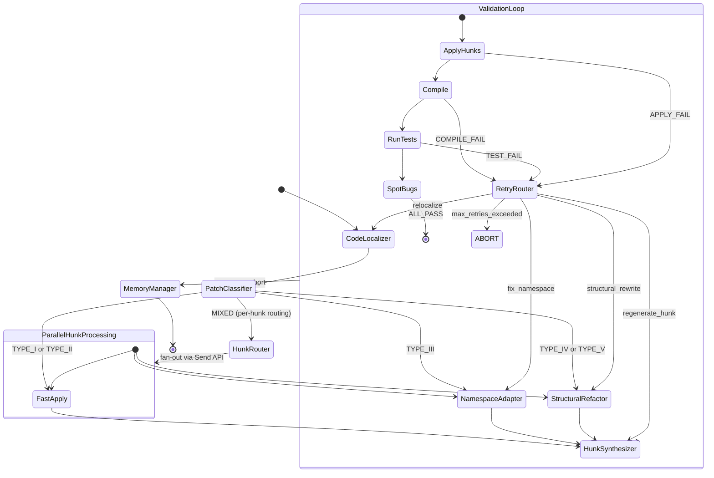

# Production-grade multi-agent system for automated Java patch backporting

**The optimal architecture is a 9-agent LangGraph state machine that routes patches through complexity-tiered pipelines, combining Claude Code's memory patterns with hybrid code localization (git pickaxe + GumTree AST diff + JavaParser symbol resolution + embedding search) to achieve high backport success across TYPE I–V patches.** This design replaces the current monolithic 5-phase pipeline with per-hunk type routing, structured retry contexts, and a persistent lessons-learned memory layer. The key insight from analyzing both Claude Code's leaked architecture and SWE-bench literature is that intelligence should live in the model while the orchestrator stays "dumb" — and that context isolation via sub-agent forking, not context cramming, is how production systems handle 10M+ line codebases.

---

## Architecture informed by Claude Code's leaked internals

The March 2026 leak of `@anthropic-ai/claude-code` (~512K lines TypeScript, 1,900 files, codename **Tengu**) revealed production patterns directly applicable to patch backporting. The core runtime is a **TAOR loop** (Think-Act-Observe-Repeat) inside a 46,000-line `QueryEngine.ts` — the orchestrator is deliberately a "dumb loop" that lets the model decide all tool calls and stop conditions. Three architectural patterns from Claude Code should be adopted wholesale.

**Three-tier memory architecture.** Claude Code uses a perpetually-loaded MEMORY.md index (200 lines, ~25KB of pointers), on-demand topic files for detailed knowledge, and JSONL session transcripts searched only via grep. The index is always in context; topic files load when relevant; transcripts are never bulk-loaded. For backporting, this maps to: a **PatchKnowledgeIndex** always in the system prompt listing known API renames, version-specific gotchas, and common failure patterns per target repo; **TopicFiles** per repository (e.g., `elasticsearch_api_changes.md`) loaded when processing that repo; and **SessionTranscripts** of past backport attempts searchable by symbol name.

**AutoDream background consolidation.** Claude Code's memory consolidation daemon runs after a triple gate (24 hours + 5 sessions + exclusive lock), executing a 4-phase cycle: Orient → Gather Signal → Consolidate → Prune Index. For the backporting system, a **ConsolidationAgent** should run after every batch of 50 patches, scanning validation results to extract durable lessons: "In Elasticsearch 7.x→6.x, `ActionListener.wrap()` was renamed to `ActionListener.toBiConsumer()`" or "CrateDB patches touching `io.crate.sql` always require import adaptation for `io.crate.analyze`." These lessons feed the PatchKnowledgeIndex, preventing repeated failures on known patterns.

**Cache-aware prompt assembly with static/dynamic boundary.** Claude Code splits its 30-40K token system prompt into 7 static sections (cached globally) and 13 dynamic sections (rebuilt per session), with a deliberate cache-busting boundary to maximize prompt cache reuse (~76% cost reduction). The backporting system should place patch-type routing rules, CLAW application instructions, and build system conventions in the static section, while repository-specific context, the current patch diff, and retry history go in the dynamic section.

---

## Hybrid code localization combines five techniques

Research across SWE-bench tools (Agentless, AutoCodeRover, SWE-agent, Aider, Moatless) and academic literature (PortGPT, mpatch, LLMPORT, FixMorph) reveals that no single localization technique dominates. The highest-performing systems use **cascading hybrid approaches**. Agentless achieves 85% file-level hit rate with a 3-phase cascade (file → function → line); PortGPT achieves **94.5%** on identical patches using edit-distance-based tracing; mpatch correctly applies **44% more patches** than `git cherry-pick` using line-level LCS matching.

The recommended localization pipeline for each hunk operates in five stages, ordered by cost:

**Stage 1 — Git-native localization (free, <100ms).** Run `git diff --find-renames=30 source target` to detect file renames. Use `git log -S "symbol_name"` (pickaxe) to find where specific symbols were added or removed between branches. Use `git log --follow -- path/to/file.java` for rename tracking. Compare blob SHAs via `git ls-tree` to identify files with identical content across branches. This stage resolves **100% of TYPE I** patches and provides file-level mapping for TYPE II–V.

**Stage 2 — Fuzzy text matching (<1s per file).** For hunks where git localization found the target file but context lines don't match exactly, apply sliding-window comparison using RapidFuzz token_sort_ratio with a 0.75 threshold. Compute line-level LCS (mpatch's algorithm) between the original hunk context and the target file. This handles whitespace changes, minor reformatting, and small context drift. Resolves most **TYPE II** patches.

**Stage 3 — AST structural matching via GumTree (~2-5s per file).** When fuzzy matching confidence is below threshold, use `gumtree-spoon-ast-diff` to compute structural edit scripts between the source and target versions of each file. GumTree detects four operation types — Insert, Delete, Update, Move — and critically identifies **moved methods and renamed identifiers** that text diff shows as unrelated deletions and additions. This resolves **TYPE III** patches where namespace changes make text matching fail.

**Stage 4 — Symbol resolution via JavaParser (<500ms per query).** For TYPE III/IV patches with import changes, use JavaParser's `CombinedTypeSolver` (chaining `JavaParserTypeSolver` for source dirs + `JarTypeSolver` for dependencies + `ReflectionTypeSolver` for JDK) to resolve fully qualified names. Build a symbol mapping between branches: `old.package.ClassName.method()` → `new.package.ClassName.method()`. Use japicmp on compiled JARs for authoritative API change detection between branches (processes ~1,700 classes in under 1 second).

**Stage 5 — Embedding-based semantic search (LLM fallback).** For TYPE V patches where structural analysis insufficient, embed code chunks using UniXcoder (best performer for fault localization: 49% better than CodeBERT at Top-1 on Defects4J) stored in a FAISS index. Query with the original patch context to find semantically similar code in the target branch. This handles cases where code was completely restructured but functionally equivalent code exists elsewhere.

---

## The 9-agent LangGraph architecture

The system comprises 9 specialized agents orchestrated as a LangGraph `StateGraph` with conditional routing, parallel fan-out via the `Send` API, and structured retry loops.



### Agent specifications and responsibilities

**Agent 0 — Git Orchestrator.** Manages all repository state: branch checkouts, working tree isolation (via `git worktree`), patch extraction, and rollback on failure. Implements safety guardrails inspired by Claude Code's fail-closed bash parser — all git operations go through an allowlist. Maintains a clean/dirty state tracker so validation failures always roll back to a known-good state. Uses `git stash` and `git worktree` to enable parallel processing of independent file groups without workspace conflicts.

**Agent 1 — Code Localizer.** Executes the 5-stage hybrid localization pipeline described above. Operates per-hunk, per-file. Produces a `LocalizationResult` for each hunk containing: target file path, target line range, confidence score, localization method used, and a context snapshot of the target region. For multi-file patches, runs file localization in parallel using `Send` API when files are independent. This agent replaces and subsumes the current `context_analyzer_node` (Phase 1) and part of `structural_locator_node` (Phase 2).

```python
class LocalizationResult(BaseModel):
    hunk_id: str
    target_file: str
    target_start_line: int
    target_end_line: int
    confidence: float
    method_used: Literal["git_native", "fuzzy_text", "gumtree_ast", "symbol_resolution", "embedding_search"]
    target_context: str  # actual code at target location
    symbol_mappings: dict[str, str]  # old_symbol -> new_symbol
    api_changes: list[APIChange]  # from japicmp if applicable
```

**Agent 2 — Patch Classifier.** Uses Claude Haiku (cheapest tier) with structured output to classify each patch and each hunk within a patch based on the original patch AND the localization evidence from Agent 1. Input: the unified diff, the localization results (including method used like `git_exact` vs `gumtree_ast`), target context, and PatchKnowledgeIndex. Output: `PatchClassification` with per-hunk type assignments (TYPE I–V), confidence scores, and a recommended processing route. Pre-processing (like auto-generated file detection) is handled by a separate utility before classification. The classification schema:

```python
class HunkClassification(BaseModel):
    hunk_id: str
    patch_type: Literal["TYPE_I", "TYPE_II", "TYPE_III", "TYPE_IV", "TYPE_V"]
    confidence: float  # 0.0-1.0
    signals: list[str]  # e.g., ["file_renamed", "import_changed", "method_signature_different"]
    estimated_tokens: int  # budget estimate for processing

class PatchClassification(BaseModel):
    overall_type: Literal["TYPE_I", "TYPE_II", "TYPE_III", "TYPE_IV", "TYPE_V", "MIXED"]
    hunks: list[HunkClassification]
    route: Literal["fast_apply", "namespace_adapt", "structural_refactor", "mixed_routing"]
    estimated_total_tokens: int
    skip_reason: Optional[str]  # auto-generated file detection
```

Features for classification include: the method used to locate the hunk (`git_exact` usually means TYPE I, `fuzzy` usually TYPE II, `gumtree_ast` or `javaparser` indicate TYPE III/IV), import statement changes, method signature differences (extracted via JavaParser AST comparison), context line divergence score (RapidFuzz ratio between original context and target file), and whether the patch touches files flagged in the PatchKnowledgeIndex.

**Agent 3 — Fast-Apply Agent.** Handles TYPE I and TYPE II patches with minimal LLM usage. For TYPE I: direct `git apply` or CLAW exact-string replacement (the existing `apply_hunk_with_claw_approach()`). For TYPE II: line-offset adjustment using localization results — rewrite the hunk header line numbers and apply. This agent should succeed without any LLM call in ~80% of TYPE I/II cases, using LLM only when CLAW's exact-string pre-validation fails.

**Agent 4 — Namespace Adapter.** Handles TYPE III patches. Takes the `symbol_mappings` from the Code Localizer and systematically rewrites: import statements (using JavaParser's `ImportDeclaration` manipulation), fully qualified type references, method names, and variable names. Uses Claude Sonnet with a focused prompt containing only the hunk, the symbol mapping table, and the target file's import section. Token budget: ~2K input, ~1K output per hunk.

**Agent 5 — Structural Refactor Agent.** Handles TYPE IV and V patches requiring deep analysis. Uses Claude Sonnet/Opus with extended thinking enabled. Input includes: the original patch, GumTree edit scripts for all affected files, japicmp API change reports, call graph snippets (if API signatures changed), and any relevant PatchKnowledgeIndex entries. This agent reasons about how to achieve the same semantic effect in a structurally different codebase. Token budget: ~15K input, ~5K output per hunk — but only invoked for the hardest patches.

**Agent 6 — Hunk Synthesizer.** Produces CLAW-compatible exact-string hunk pairs (`old_string`/`new_string`) from each upstream agent's output. Critical constraint: the `old_string` must exist verbatim in the target file (CLAW pre-validates before mutation). This agent takes the adaptation plan and the actual target file content, then generates the precise replacement strings. Uses a verification step: search for `old_string` in target file content before emitting. If not found, falls back to expanding the context window (±5 lines) and retrying.

**Agent 7 — Validation Loop (enhanced Agent 4).** The existing `validation_agent.py` "Prove Red, Make Green" loop, enhanced with structured retry routing. Instead of returning a plain `regeneration_hint` string, returns a `PatchRetryContext`:

```python
class PatchRetryContext(BaseModel):
    attempt_number: int
    max_attempts: int  # 3 default, configurable
    failure_type: Literal[
        "apply_failure_path", "apply_failure_context_mismatch", "apply_failure_unknown",
        "compile_error_missing_import", "compile_error_missing_symbol", 
        "compile_error_type_mismatch", "compile_error_other",
        "test_failure_assertion", "test_failure_runtime", "test_failure_infrastructure",
        "spotbugs_violation"
    ]
    failed_hunks: list[str]  # hunk_ids that caused the failure
    error_details: CompilerErrorDetail | TestFailureDetail | ApplyFailureDetail
    previous_approaches: list[str]  # what was tried before
    suggested_route: Literal["regenerate_hunk", "relocalize", "fix_namespace", "structural_rewrite", "abort"]
    token_budget_remaining: int
    
class CompilerErrorDetail(BaseModel):
    file: str
    line: int
    error_code: str
    missing_symbol: Optional[str]
    expected_type: Optional[str]
    actual_type: Optional[str]
    attributed_hunk_id: Optional[str]  # from existing _classify_build_failure()
```

The retry router uses deterministic rules: `apply_failure_context_mismatch` → relocalize (Code Localizer with expanded search); `compile_error_missing_import` → Namespace Adapter; `compile_error_missing_symbol` → Structural Refactor; `test_failure_assertion` → regenerate hunk with test output in context. Budget decreases per attempt: attempt 1 = 100%, attempt 2 = 60%, attempt 3 = 30% of token allocation.

**Agent 8 — Memory Manager.** Runs after every patch (success or failure). Updates the PatchKnowledgeIndex with new symbol mappings discovered during this patch, failure patterns encountered, and per-repository conventions learned. Implements the AutoDream consolidation pattern: after every 50 patches, runs a background consolidation pass that merges redundant entries, converts relative references to absolute, and prunes stale information. Stores data in SQLite with the schema:

```python
class PatchLesson(BaseModel):
    repo: str
    source_branch: str
    target_branch: str  
    patch_type: str
    symbols_remapped: dict[str, str]
    failure_pattern: Optional[str]
    resolution: Optional[str]
    success: bool
    tokens_used: int
    timestamp: datetime
```

### Shared state design

All agents read from and write to a single `BackportState` TypedDict using LangGraph reducers:

```python
class BackportState(TypedDict):
    # Input
    patch_id: str
    original_diff: str
    commit_message: str
    source_branch: str
    target_branch: str
    repo_path: str
    build_system: Literal["maven", "gradle"]
    
    # Classification
    classification: PatchClassification
    
    # Localization (per-hunk results accumulated via operator.add)
    localization_results: Annotated[list[LocalizationResult], operator.add]
    
    # Synthesized hunks
    adapted_hunks: Annotated[list[CLAWHunk], operator.add]
    
    # Validation
    validation_result: Optional[ValidationResult]
    retry_context: Optional[PatchRetryContext]
    attempt_number: int
    
    # Memory
    relevant_lessons: list[PatchLesson]
    new_lessons: Annotated[list[PatchLesson], operator.add]
    
    # Metrics
    tokens_used: Annotated[dict[str, int], merge_dicts]  # per-agent token tracking
    phase_latencies: Annotated[dict[str, float], merge_dicts]
    
    # Control
    status: Literal["classifying", "localizing", "adapting", "synthesizing", 
                     "validating", "retrying", "succeeded", "failed", "skipped"]
```

### Multi-file parallelization strategy

For patches touching N files, the system uses a **dependency-aware parallel/sequential hybrid**:

1. The Code Localizer analyzes import graphs between changed files using JavaParser. If File A imports File B and both are modified, they form a dependency group.
2. Independent files (no cross-file import dependencies in the changed set) are dispatched in parallel via `Send` API with `max_concurrency=5`.
3. Dependent file groups are processed sequentially in topological order (dependency providers before consumers).
4. After all hunks are synthesized, a single atomic validation pass applies all hunks together and runs compilation + tests.

For mixed-complexity patches (common: some hunks TYPE I, others TYPE V in the same commit), the **HunkRouter** node fans out individual hunks to the appropriate agent via `Send`, then collects results through the `operator.add` reducer on `adapted_hunks`. This avoids running expensive structural analysis on trivial hunks.

### Token optimization per agent

| Agent | Model | Input Budget | Output Budget | Key Context Inclusions | Key Exclusions |
|-------|-------|-------------|---------------|----------------------|----------------|
| Patch Classifier | Haiku | 4K | 500 | Diff, file paths, commit msg, 10 most relevant lessons | File contents, test files |
| Code Localizer | Haiku + tools | 8K | 1K | Target file skeleton (signatures only), git search results | Full file contents of unrelated files |
| Fast-Apply | None (deterministic) | — | — | — | — |
| Namespace Adapter | Sonnet | 3K | 1K | Hunk, symbol map, target file imports section | Full target file, other hunks |
| Structural Refactor | Sonnet (extended thinking) | 15K | 5K | Hunk, GumTree edit script, japicmp report, target method ±50 lines | Unrelated files, build configs |
| Hunk Synthesizer | Sonnet | 5K | 2K | Adaptation plan, exact target file region | Other files, full diff |
| Validation Loop | Sonnet | 8K | 2K | Compiler/test output, failed hunk, retry context | Passing hunks, unrelated errors |
| Memory Manager | Haiku | 3K | 500 | Patch outcome, new symbol mappings | Raw compiler output |

---

## Java tool integration recommendations

**Primary AST tool: JavaParser 3.28.x.** Best balance of speed, API simplicity, and adequate symbol resolution for the backporting use case. Parses individual files in sub-second time. The `CombinedTypeSolver` chains `JavaParserTypeSolver` (source directories), `JarTypeSolver` (dependency JARs via javassist), and `ReflectionTypeSolver` (JDK runtime) for cross-module resolution. Known limitations with complex generics and varargs are acceptable since backporting rarely changes generic signatures. Use JavaParser for: extracting method/class signatures for repo maps, manipulating import declarations, resolving qualified names during namespace adaptation, and generating skeleton views for context windows.

**Structural diffing: gumtree-spoon-ast-diff 1.9.** The SpoonLabs wrapper around GumTree provides Java-optimized AST differencing via Spoon's metamodel. Detects Insert, Delete, Update, and critically **Move** operations that text diff cannot identify. Configure with `bu_minsim=0.2` and `bu_minsize=600` for large Java files (tuned for fewer spurious matches). Performance note: matching phase can take 50 seconds on deeply nested ASTs — set a 30-second timeout and fall back to text-based diffing if exceeded. Use for: detecting method/class moves between versions, identifying renamed identifiers, and building structural edit scripts for TYPE III–V patches.

**API change detection: japicmp 0.25.4.** Compares compiled JARs and reports all API differences in structured XML/JSON: changed/removed/added classes, methods, fields, return types, parameter types, exceptions, and access modifiers. Processes ~1,700 classes in under 1 second. Run at the start of each batch for a given source→target branch pair and cache the results. The output directly feeds the Namespace Adapter's symbol mapping table. For repos that can't easily be compiled to JARs, fall back to JavaParser source-level API extraction.

**Call graph analysis: skip for primary workflow.** WALA and SootUp both require compiled bytecode, are expensive to run, and provide more information than needed for most backporting. Reserve for an optional "impact analysis" step when TYPE V patches modify public API signatures and we need to identify all transitive callers. If needed, SootUp 2.0 (March 2025) is the modern choice — no singletons, immutable IR, lazy class loading, supports Java 21 bytecode.

**Build system integration from Python.** Use `subprocess.run()` for both Maven and Gradle, matching the existing `validation_tools.py` pattern. Key commands: `mvn test -Dtest=ClassName#method -pl module -DfailIfNoTests=false --batch-mode` for Maven; `./gradlew :module:test --tests "pkg.Class.method" --no-daemon --console=plain` for Gradle. Set `timeout=600` for compilation, `timeout=300` for targeted tests. Parse Maven compiler errors via regex on `[ERROR]` lines (existing `_classify_build_failure()` pattern). For Gradle, parse `> Task :module:compileJava FAILED` patterns.

**SpotBugs improvements.** Use `onlyAnalyze` to scope analysis to modified packages only (reduces runtime from minutes to seconds on large codebases). Add custom detectors for common backporting regressions: null-safety violations from API changes, resource leak patterns from modified try-with-resources, and unchecked exception propagation from changed exception hierarchies. Invoke as `mvn spotbugs:check -DspotbugsXmlOutput=true` and parse the XML output for structured violation details.

---

## Integration plan with existing pipeline

### What to keep, replace, and augment

| Component | Action | Rationale |
|-----------|--------|-----------|
| `evaluate_full_workflow.py` orchestrator | **Keep + augment** | Add new phases, keep existing metric tracking and caching |
| Phase 0 (baseline test + staleness cache) | **Keep as-is** | Working correctly, no changes needed |
| Phase 1 (`context_analyzer_node`) | **Replace** with Patch Classifier + Code Localizer | Current implementation lacks hybrid localization |
| Phase 2 (`structural_locator_node`) | **Replace** with Code Localizer Stage 3-5 | Augment with GumTree, JavaParser, embedding search |
| Phase 3 (hunk generation) | **Replace** with Hunk Synthesizer | Must produce CLAW-compatible exact-string pairs |
| Phase 4 (`validation_agent.py`) | **Augment** with structured retry routing | Keep "Prove Red, Make Green" loop; replace `regeneration_hint` with `PatchRetryContext` |
| `validation_tools.py` (`ValidationToolkit`) | **Keep + augment** | CLAW approach works well; add GumTree and JavaParser tool methods |
| `utils/patch_analyzer.py` | **Augment** with per-hunk TYPE I-V classification | Currently does patch-level analysis only |
| `utils/patch_complexity.py` | **Augment** with AST-based features | Add GumTree-derived features for classification |
| Auto-generated file detection (ANTLR/Protobuf/gRPC) | **Augment** | Add detection for Lombok-generated, MapStruct, JOOQ, Thrift patterns |

### Insertion points for new components

**Code Localizer insertion (between current Phase 1 and Phase 2).** Create `agents/code_localizer.py` implementing the 5-stage localization pipeline. The LangGraph graph adds a `code_localizer_node` between classification and adaptation. The node receives `PatchClassification` from the classifier and outputs `list[LocalizationResult]` to state. It calls JavaParser and GumTree via a new `utils/java_tools.py` module that wraps the Java tools as subprocess calls (JavaParser and GumTree run as a small Java microservice, communicating via JSON over stdin/stdout or a local HTTP API).

**Structural Locator enhancement.** The existing `structural_locator_node` becomes the Structural Refactor Agent, receiving pre-computed localization results and GumTree edit scripts instead of performing localization itself. Its prompt now focuses exclusively on adaptation strategy rather than code search.

**Hunk Generator enhancement for CLAW compatibility.** The existing hunk generator must output exact `old_string`/`new_string` pairs where `old_string` is verified to exist verbatim in the target file. Add a post-generation validation step: `assert old_string in target_file_content`. If assertion fails, expand context by ±3 lines and regenerate. This matches the existing `apply_hunk_with_claw_approach()` pre-validation pattern.

**Converting `regeneration_hint` to `PatchRetryContext`.** The existing `validation_models.py` already defines retry-related models (visible from imports). Extend the `ValidationResult` returned by `validation_agent.py` to include a full `PatchRetryContext` object. The retry router in the LangGraph graph uses `add_conditional_edges` from the validation node, branching on `retry_context.suggested_route` to route back to the appropriate upstream agent rather than always restarting from hunk generation.

### Migration strategy

Phase the migration across three releases to avoid regression:

1. **Release 1**: Add Patch Classifier and Code Localizer as optional pre-processing steps. Run them in shadow mode alongside existing Phases 1-2. Compare localization accuracy without changing the execution path. Add japicmp integration and PatchKnowledgeIndex.

2. **Release 2**: Replace Phase 1 and Phase 2 with the new classifier and localizer. Enhance hunk generation with CLAW verification step. Add structured `PatchRetryContext` to validation loop. Measure impact on 491-example dataset.

3. **Release 3**: Add Namespace Adapter and Structural Refactor agents. Enable per-hunk type routing for mixed-complexity patches. Add Memory Manager and background consolidation. Enable parallel multi-file processing.

---

## Evaluation harness design

### Primary metrics on the 491-example dataset

Track five metrics at per-patch and aggregate levels, broken down by TYPE I–V:

| Metric | Definition | Target |
|--------|-----------|--------|
| **Patch apply rate** | % of patches where all hunks apply without CLAW failure | >95% TYPE I, >85% TYPE II, >70% TYPE III |
| **Compile rate** | % of applied patches that compile successfully | >98% for all types |
| **Test pass rate (fail→pass)** | % where baseline test fails but post-patch test passes | Primary success metric |
| **Token cost per patch** | Total tokens (input + output) across all agents | <10K TYPE I, <30K TYPE III, <100K TYPE V |
| **Latency (wall clock)** | Seconds from patch input to validation complete | <30s TYPE I, <120s TYPE III, <300s TYPE V |

### TYPE I–V breakdown methodology

Classify all 491 examples using the Patch Classifier agent, then report metrics per type. Expected distribution based on PortGPT's findings: ~40% TYPE I, ~20% TYPE II, ~15% TYPE III, ~10% TYPE IV, ~15% TYPE V. The per-type breakdown reveals where the system adds value — TYPE I should be near-100% (automated `git apply`), while TYPE V success rate is the meaningful measure of the multi-agent architecture's contribution.

### Ablation study design

Measure five ablation conditions to isolate per-agent contribution:

1. **No Classifier** (all patches go through full pipeline) → measures routing efficiency gain
2. **No GumTree** (text-only localization) → measures structural diffing contribution
3. **No japicmp** (no pre-computed API diff) → measures symbol mapping contribution
4. **No Memory Manager** (no lessons learned) → measures knowledge persistence value
5. **No per-hunk routing** (all hunks same pipeline) → measures mixed-complexity handling

For each ablation, run the full 491-example dataset and compare against the full system. Report delta in test pass rate, token cost, and latency. Use McNemar's test for statistical significance on pass/fail differences.

### Regression detection

Implement a **golden set** of 50 patches (10 per type) that must maintain 100% success rate across system changes. Run this golden set as a CI check on every agent modification. Store results in the existing `pipeline_summary` JSON format, extended with:

```python
{
    "patch_id": "...",
    "classification": {"overall_type": "TYPE_III", "hunks": [...]},
    "localization_method": "gumtree_ast",
    "agents_invoked": ["classifier", "localizer", "namespace_adapter", "synthesizer", "validator"],
    "retry_count": 1,
    "tokens_by_agent": {"classifier": 450, "localizer": 2100, ...},
    "latency_by_phase": {"classification": 1.2, "localization": 3.8, ...},
    "result": "pass",
    "new_lessons": [{"symbol": "ActionListener.wrap", "remapped_to": "ActionListener.toBiConsumer"}]
}
```

---

## Risks, edge cases, and mitigations

**Localization failure in very large repos.** Elasticsearch exceeds 10M lines. The embedding-based search (Stage 5) requires indexing the full codebase, which at ~500 tokens per Java file and ~20K files means ~10M tokens to embed. Mitigation: pre-compute FAISS indexes per branch and cache them. Only re-index changed files on each run using git diff to identify modified files. Limit search scope to the module containing the target file ± directly dependent modules (identified via Gradle/Maven dependency declarations).

**Circular rename chains breaking `git --follow`.** When File A is renamed to File B, then File B is renamed to File C across multiple commits, `git log --follow` may lose track. Mitigation: combine `--follow` with pickaxe search (`git log -S "unique_class_name"`) and blob SHA comparison. If `--follow` fails, fall back to searching for the file's unique class declaration string across the target branch.

**Auto-generated file false negatives.** The current system detects ANTLR, Protobuf, and gRPC generated files. Additional patterns to detect: Lombok `@Generated` annotations, MapStruct `@Generated` with `mapstruct` processor value, JOOQ-generated `org.jooq.generated` packages, Thrift-generated `@javax.annotation.Generated("Autogenerated")`, and OpenAPI/Swagger codegen `@javax.annotation.Generated(value = "io.swagger")`. Use a regex scan of the first 30 lines of each file for `@Generated`, `// Generated by`, `/* AUTO-GENERATED */`, and similar markers.

**Maven multi-module vs Gradle multi-project differences.** Maven uses `<modules>` in parent POM with `mvn -pl module-name` for targeted builds. Gradle uses `settings.gradle` with `include` and `./gradlew :module:task` syntax. The Git Orchestrator must detect the build system (presence of `pom.xml` vs `build.gradle`) and use the appropriate command templates. The existing `validation_tools.py` already handles both — this pattern should be preserved. Edge case: some projects use both (Gradle wrapper invoking Maven) — detect via `build.gradle` that shells out to `mvn`.

**TYPE V patches touching 10+ files.** These are the hardest cases. Mitigation: impose a **file budget** of 15 files per patch. Beyond 15, split into sub-patches by dependency group and process groups sequentially. Each group gets its own validation pass. If inter-group dependencies exist, process in topological order based on import analysis. Token budget for 10+ file patches: allocate 80K tokens total, with Structural Refactor Agent getting 50% and other agents sharing the remainder.

**Patches creating or deleting entire files.** File creation requires: identifying the correct target directory (may differ between branches), generating the full file content with adapted imports/packages, and registering the file with the build system (Maven: verify package structure matches directory; Gradle: ensure source set includes the directory). File deletion requires: verifying no remaining references to deleted symbols (use JavaParser to search for imports/references across the module), and removing the file from build configs if explicitly listed. The Git Orchestrator handles the actual `git add`/`git rm` operations.

**Token budget exhaustion mid-patch.** Implement a **token circuit breaker** modeled after Claude Code's compaction system. Track cumulative tokens across all agents. At 70% of budget, switch Structural Refactor from Opus to Sonnet. At 85%, switch all agents to Haiku with simplified prompts. At 95%, abort with a structured failure report capturing partial progress and suggested manual intervention points. Store the partial state via LangGraph checkpointing so the patch can be resumed with a fresh budget.

**Test infrastructure failures masking code failures.** The existing `classify_test_failure_signal()` distinguishes infrastructure failures from code failures. Enhance with: timeout detection (test hung vs. legitimately slow), OOM detection (parse JVM exit code 137/heap dump presence), and flaky test detection (run failing tests 3 times; if results differ, flag as infrastructure). For Elasticsearch specifically, respect the existing `ELASTICSEARCH_HARNESS_EXCLUDED_TEST_MODULES` frozenset and add runtime detection of `org.elasticsearch.test.ESTestCase` infrastructure assertions vs. application-level assertions.

---

## Conclusion

The architecture described here transforms a monolithic 5-phase pipeline into a type-routed, per-hunk multi-agent system that spends minimal tokens on easy patches and concentrates expensive reasoning on genuinely hard structural adaptations. Three design decisions carry the most impact. First, **hybrid localization cascading from free git operations through progressively expensive analysis** ensures that the ~60% of patches that are TYPE I/II never invoke an LLM for localization at all. Second, **structured retry contexts replacing string hints** enable the validation loop to route failures to the specific agent that can fix them rather than restarting from scratch. Third, **persistent memory with background consolidation** means the system gets smarter over time — API rename mappings discovered during patch #47 are available instantly for patch #248 against the same branch pair.

The key risk is integration complexity: wrapping JavaParser and GumTree as Java microservices callable from Python adds operational overhead. The mitigation is a thin JSON-over-stdin/stdout protocol with a single long-lived JVM process, avoiding per-invocation JVM startup costs. Start with Release 1's shadow-mode deployment against the 491-example dataset to validate the hybrid localization approach before committing to the full agent restructuring.